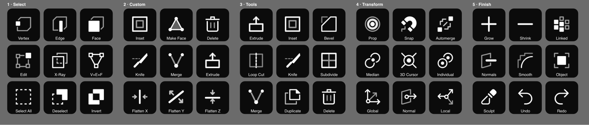
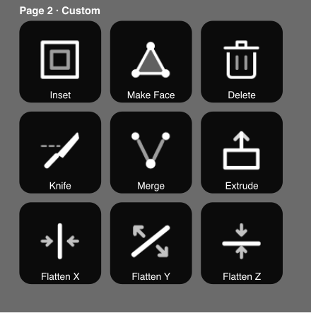
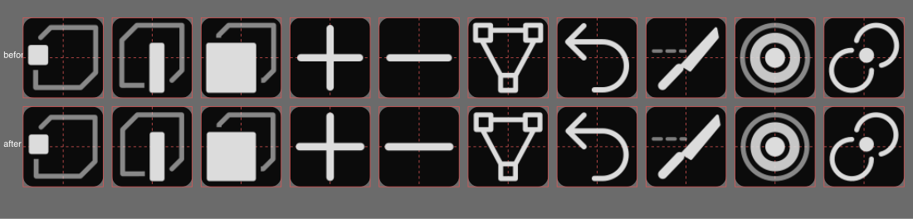

# Blender MX Creative

Drive Blender from a Logitech MX Creative Console — a Logi Options+ plugin plus the
small Blender add-on it talks to.

It is built for editing a mesh by hand: vertex / edge / face select mode, the
modelling tools, snapping, pivot and orientation — with the keys showing what is
actually live in Blender instead of being blind shortcuts.



macOS only for now. Tested with Blender 5.2, Logi Options+ 2.7 and Logi Plugin
Service 6.4 on Apple silicon.

GPL-3.0-or-later throughout, because it bundles Blender's own UI icons and the
add-on uses `bpy` — see [NOTICE.md](NOTICE.md).

## How it works

```
MX Creative Console  ->  Logi Plugin Service  ->  Blender plugin (C#)
                                                      |
                                        127.0.0.1:47800 (JSON lines)
                                                      |
                                            MX Console Bridge add-on  ->  bpy
```

Every button tries the bridge first. The add-on runs the real Blender operator and
returns a state snapshot, which is what lets a key light up when its mode is live.

If the add-on is not running, buttons fall back to sending the ordinary keyboard
shortcut. You lose the state readout, not the function. The fallback sends physical
key codes, so it also works on layouts where the digits need Shift — a Czech QWERTZ
keyboard, for instance, where `1`–`3` would otherwise never reach Blender.

The fallback only covers an add-on that cannot be reached. When Blender *is*
reached and refuses the command — almost always the wrong mode — nothing is sent,
because the shortcut would then fire whatever that key means in the current
context: in object mode `1`, `2` and `3` toggle collection visibility rather than
select modes.

Undo and redo are keystroke-only on purpose: Blender refuses to run `ed.undo` from
outside its own event loop.

## Install

### 1. The Blender add-on

Blender → Edit → Preferences → Add-ons → the ▾ menu → *Install from Disk…* → pick
`dist/blender_mx_bridge.zip`. It enables itself and starts listening on
`127.0.0.1:47800`; the port is configurable in the add-on preferences.

Then **Save Preferences**, or the add-on will not be enabled the next time Blender
starts.

Updating the add-on later needs a Blender restart. Installing over it replaces the
files on disk, but the old module stays loaded in memory, so the running Blender
keeps behaving exactly as it did — which reads as the update having done nothing.

### 2. The Options+ plugin

`logiplugintool install` hands off to the Options+ UI and fails from a terminal
("Plugin installation cannot start"), so unpack the package by hand:

```bash
PLUGINS=~/"Library/Application Support/Logi/LogiPluginService/Plugins"
rm -rf "$PLUGINS/Blender"
mkdir -p "$PLUGINS/Blender"
unzip -q dist/Blender.lplug4 -d "$PLUGINS/Blender"
open "loupedeck://plugin/Blender/reload"
```

The package ships default profiles, so the keypad comes populated — four pages of
nine keys, plus the Dialpad's two dials and four buttons. Nothing to drag.

Default profiles are only applied when a profile is *created*: on first install, on
*Add profile*, or on reset. If an empty Blender profile already exists from an
earlier attempt, delete it first so it gets rebuilt from the template:

```bash
rm -rf ~/"Library/Application Support/Logi/LogiPluginService/Applications"/Loupedeck7*/@_blender
```

To confirm the plugin is live, look for `Connected to the Blender bridge` in
`~/Library/Application Support/Logi/LogiPluginService/Logs/plugin_logs/Blender.log`.

In Options+ the actions live under *All Actions → Installed Plugins → Blender* if
you want to rearrange them.

## What is on offer

| Group | Actions |
| --- | --- |
| Select Mode | Vertex, Edge, Face, Vert+Edge+Face |
| Mode | Edit Mode (toggle), Object, Sculpt |
| Selection | Select All, Deselect, Invert, Linked, Grow, Shrink |
| Mesh Tools | Extrude, Inset, Bevel, Loop Cut, Knife, Subdivide, Merge, Make Face, Delete, Duplicate, Flatten X/Y/Z, Recalc Normals, Shade Smooth |
| Toggles | X-Ray, Proportional, Snap, Auto Merge |
| Pivot Point | Median, 3D Cursor, Individual, Active, Bounding Box |
| Orientation | Global, Local, Normal, View, Gimbal, 3D Cursor |
| History | Undo, Redo |
| Dials | Proportional Size, Subdivision Level |

Subdivide has no default shortcut in Blender, so that one needs the add-on running,
and so do Flatten X/Y/Z — those stand in for typing `S` `Z` `0`, a sequence rather
than a shortcut, so there is nothing for the fallback to send.

The shipped keypad pages are **Select**, **Custom**, **Tools**, **Transform** and
**Finish**, in that order. *Custom* is a working page: inset, make face, delete,
knife, merge, extrude and the three flattens, kept together because that is one
person's modelling loop. Edit `KEYPAD_PAGES` in `tools/make_profiles.py` and
regenerate to make it yours.



There is no default profile for the Actions Ring.

Icons are Blender's own UI icons, recoloured and rendered per button. The six tool
icons Blender ships only in its internal `VCO` format — extrude, inset, subdivide,
loop cut, knife, merge — are redrawn here to match. See [NOTICE.md](NOTICE.md) for
what that means for licensing.

## Why this is not on the Logitech Marketplace

The package itself would pass: `logiplugintool verify` is happy, the icon is in
`metadata/`, and `LoupedeckPackage.yaml` carries the licence and URLs the approval
guidelines ask for. The licence is what keeps it here instead.

Marketplace approval requires open-source components to be MIT or Apache 2.0 and
excludes GPL outright — and this is GPL, necessarily so, because it ships Blender's
icons and drives Blender through `bpy`. Going the other way would mean redrawing
all 39 icons so nothing GPL remains in the package, plus a Developer EULA.

Installing from this repository costs one `unzip` and avoids the whole question.

## Development

Logi Plugin Service 6.4 is built against **.NET 10**, not the .NET 8 its own SDK
documentation names. Building against .NET 8 fails with `CS1705`.

```bash
export DOTNET_ROOT="$HOME/.dotnet"
export PATH="$DOTNET_ROOT:$HOME/.dotnet/tools:$PATH"
export DOTNET_ROLL_FORWARD=LatestMajor   # logiplugintool itself targets .NET 8

cd BlenderPlugin && dotnet build
```

`dotnet build` drops `BlenderPlugin.link` into the Plugin Service's `Plugins`
folder pointing at its output. **A `.link` file wins over an installed package**,
and every build recreates it — including `-c Release` — so delete it before testing
a real `.lplug4` install. The log line `loaded from …` says which one is live.

For a tight loop: `cd BlenderPlugin/src && dotnet watch build`.

Reload with `open "loupedeck://plugin/Blender/reload"` rather than killing Logi
Plugin Service. The service drops a marker in `Logs/plugin_crashes/` before loading
a plugin and removes it once the load succeeds; kill the service mid-flight and the
marker survives, so the next start reports **"Plugin 'Blender' is disabled as it had
crashed before"** and refuses to load it. Delete
`Logs/plugin_crashes/BlenderPlugin.dll` to clear that. Killing the service also
makes it scan the plugins folder twice, which is where the alarming-looking
`Cannot load plugin … already loaded` error comes from.

### Layout

```
BlenderPlugin/src/
  BlenderPlugin.cs          plugin entry point, owns the bridge
  BlenderApplication.cs     links the plugin to org.blenderfoundation.blender
  Bridge/                   TCP client and the state snapshot
  Actions/                  buttons, one class per group
  Adjustments/              Dialpad dials
  Helpers/IconRenderer.cs   recolours and sizes the SVGs
  Icons/Blender/            Blender's own UI icons
  Icons/Tools/              the six redrawn tool icons
  package/                  everything that ships: metadata, profiles, actionsymbols
blender-addon/blender_mx_bridge/
  __init__.py               socket server, command handlers, state collection
tools/                      asset generators, see below
```

### Protocol

Newline-delimited JSON over loopback TCP.

```
-> {"id": 1, "cmd": "select_mode", "args": {"types": ["VERT"]}}
<- {"id": 1, "ok": true, "state": {"mode": "EDIT", "select_vert": true, ...}}
```

Commands: `ping`, `state`, `select_mode`, `op`, `toggle`, `set`, `snap_elements`,
`adjust`. Every response carries a full state snapshot, so a command doubles as a
refresh. Socket threads only queue work; everything touching `bpy` runs on Blender's
main thread via a timer.

Anything that writes to `bpy.data` instead of going through an operator has to ask
the interface to redraw afterwards, or the value changes while the screen keeps
showing the old one. `select_mode` learned this the hard way: setting
`tool_settings.mesh_select_mode` directly looks correct in the data and does
nothing visible, because it also skips the selection flush between modes. It now
calls `bpy.ops.mesh.select_mode`, the same operator Blender's 1/2/3 keys use.

### Regenerating the assets

Committed, but generated rather than hand-written:

```bash
python3 tools/normalize_icons.py      # square, centred viewBoxes — run after adding icons
python3 tools/make_profiles.py        # package/profiles/DefaultProfile7*.lp5
python3 tools/make_actionsymbols.py   # package/actionsymbols/*.svg
```

`normalize_icons.py` rewrites each icon's viewBox to a square centred on the
artwork, sized so every pictogram fills the same fraction of a key. Blender ships
them with assorted viewBoxes — 1100x1100, 1500x1600, 1600x1600 — which otherwise
render at visibly different sizes and positions.



It only touches the `viewBox` and the `width`/`height` that must follow it, and it
leaves a file alone once the measurement is within a few units of what is already
there — without that it feeds back on itself, because a changed viewBox shifts the
render that the next measurement reads, and the artwork creeps a unit smaller every
run. It must run before `make_actionsymbols.py`, which copies the files.

`make_actionsymbols.py` reads the icon each action declares straight out of the C#,
so the picker glyphs cannot drift from what the buttons draw. `make_profiles.py`
hard-codes the page layout; the action names it emits can be listed with

```bash
open "loupedeck://plugin/Blender/xliff"   # writes localization.generated/Blender.xliff
```

which is also the quickest way to prove the plugin is actually loaded.

## Notes from reverse-engineering the SDK

Things that cost time and are not in the SDK documentation.

### Who draws what

A key is composed by Options+ from an icon element and a text element — open
*Edit icon* on any key to see them as separate, selectable layers. The image
`GetCommandImage` returns **is the icon element**, not the whole key.

So the image carries the icon only, on a transparent background, centred, at 74% of
the element. Two mistakes follow from getting this wrong:

* Painting a label into the image duplicates the one Options+ already draws.
* Insetting the pictogram towards the top, to "leave room for the label", pushes it
  up inside an element that is already above the label — it ends up glued to the
  top of the key with a gap underneath.

Where those elements sit is not the image's business either: that comes from an icon
template. `metadata/DefaultIconTemplate.ict` sets it for every action in the plugin
(`icontemplates/<action class full name>.ict` overrides one action, and a user's
edits in *Edit icon* override both). Ours nudges the icon down and up in size:

| | Logi default | shipped |
| --- | --- | --- |
| image | x15 y7 w70 h70 | x13 y11 w74 h74 |
| text | y77 h17 | y82 h18 |

Coordinates are percentages of the key.

State shows in the icon's brightness: white when active, grey when not, dimmer still
when the action cannot do anything in the current mode. Because the image covers
only the icon element, painting a highlight behind it lands as a floating rectangle
rather than a highlighted key — brightness is the only indicator that looks right.

### Vector images report no size

`BitmapImage.FromSvg` returns an image whose size is **-1x-1** — the vector has no
raster size yet. Passing one to the three-argument
`BitmapBuilder.DrawImage(image, x, y)` throws `ArgumentNullException` deep inside
SkiaSharp. The Plugin Service catches anything `GetCommandImage` throws and quietly
falls back to drawing the action's name, so the only symptom is keys showing text
and no icon, with nothing in any log.

Always pass width and height:

```csharp
builder.DrawImage(icon, x, y, side, side);
```

`GetCommandImage` and `GetAdjustmentImage` log their own failures here, so the next
such problem is visible instead of silent.

### The application icon is copied, not read

The application tab icon is **not** read from `metadata/Icon256x256.png` at display
time. Options+ copies it to
`Applications/Loupedeck7*/@_blender/ApplicationIcon.png` when the application
profile is first created and never refreshes it, so changing the package icon has
no effect on an existing profile. The default profiles ship an `ApplicationIcon.png`
for fresh installs; to fix an existing one, overwrite those copies:

```bash
APPS=~/"Library/Application Support/Logi/LogiPluginService/Applications"
for d in "$APPS"/Loupedeck7*/@_blender; do
  cp BlenderPlugin/src/package/metadata/Icon256x256.png "$d/ApplicationIcon.png"
done
```

Options+ also keeps its own cache in
`~/Library/Application Support/LogiOptionsPlus/icon_cache`; quit Options+ and delete
that folder if a stale icon persists.

`Icon256x256.png` is cropped to fill its canvas. Blender's `.icns` follows the macOS
grid, where the artwork covers about 84% of the icon and the rest is padding —
Options+ shows plugin icons full-bleed next to each other, so that padding just
makes it look smaller than its neighbours.

### Ship nothing the host already has

The generated project copies `PluginApi.dll` and its dependencies into the output.
Logi's own bundled plugins contain only their own assemblies; a second `PluginApi`
in the package risks breaking type identity, and it inflated the package from 43 KB
to 8.8 MB. `CopyLocalLockFileAssemblies=false` plus `<Private>false</Private>` on
the reference fixes it.

## Licence

**GPL-3.0-or-later** — see [LICENSE](LICENSE).

The project bundles Blender's UI icons and its add-on uses Blender's Python API, and
both of those oblige it. [NOTICE.md](NOTICE.md) spells out which files come from
Blender, which are original, and where the Blender logo fits in.

Not affiliated with the Blender Foundation or Logitech.
